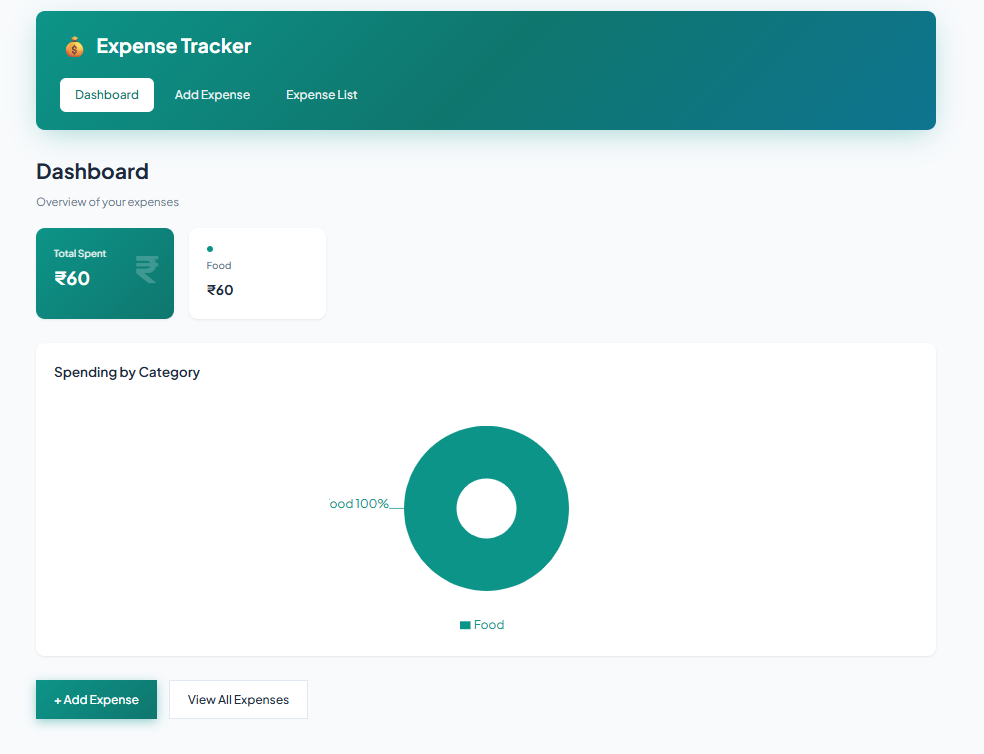
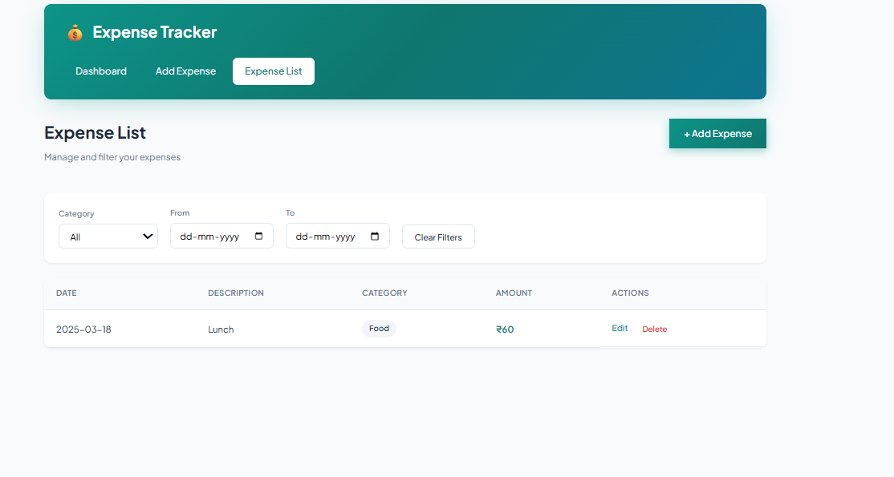
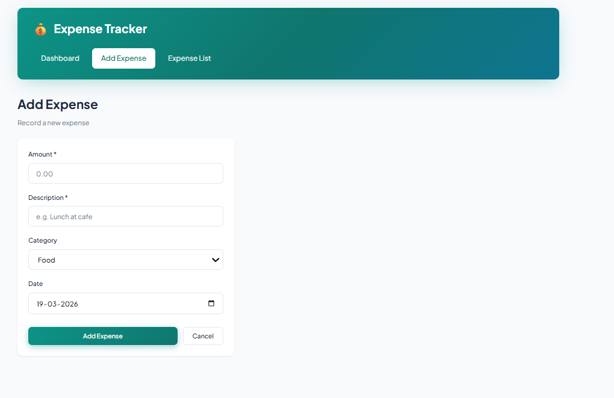

# Expense Tracker

A full-stack expense tracking app built with React and Node.js.

## Features

- Add, edit, and delete expenses
- Filter by category and date range
- Dashboard with total spent and spending by category
- Pie chart visualization
- SQLite database for persistence

## Tech Stack

- **Frontend:** React, Vite, React Router, Axios, Recharts
- **Backend:** Node.js, Express
- **Database:** SQLite (better-sqlite3)

## Setup

### Prerequisites

## Screenshots

### Dashboard

### Expense List

### Add Expense

- Node.js 20+ (or use Vite 5 with Node 20.11)
- npm

### Installation

1. Clone the repo and go to the project folder:
   
